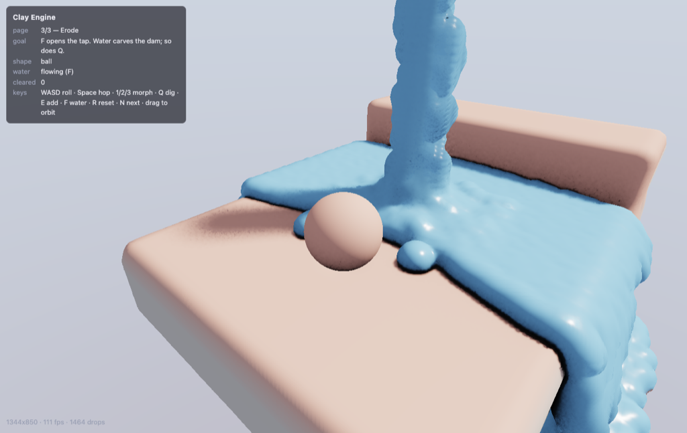

# clay-engine

A WebGPU signed-distance-field engine, and a playable Claybook clone built on it. The
world is an SDF volume, the clay body is extracted from an SDF every frame it morphs, the
water bakes itself back into an SDF, and every light term is a distance-field trace.
Nothing is baked offline; the only per-frame CPU readback is one body's centre of mass.



```
pnpm install
pnpm dev            # every demo, behind a picker -> http://localhost:4173
pnpm check          # typecheck (lib + demo) and run the unit tests
```

Requires a browser with WebGPU (Chrome 113+, Safari 18+).

One page, four demos, chosen from the select at the top left or with `#demo=`:

| `#demo=` | What it shows |
| --- | --- |
| `clay` | The Claybook clone: rolling ball, morphing, digging, water that pools and erodes. |
| `geometry` | Every geometry the engine can make, all at once, each baked mesh beside the exact primitive it overlaps with. |
| `brushes` | A hand-written primitive and three baked meshes used as ordinary brushes. |
| `analytic` | The same render path over three `@typegpu/sdf` fields. No volume, no brushes, no simulation. |

In the Claybook clone: `WASD` roll · `Space` hop · `1/2/3` morph ball/cube/rod · `Q` dig ·
`E` add clay · `F` water on/off · `R` reset page · `N` next page · drag to orbit.

URL flags for diagnosing the renderer: `#debug=shadow|ao|normal|material|taa`,
`#alpha=1` (temporal filter off), `#aoSteps=`, `#aoDistance=`, `#shadowSteps=`,
`#page=`. For the water's transparency: `#tdebug=thickness|refraction|transmitted|surface`,
`#opacity=1` (solid water again, the A/B every transparency artefact wants),
`#absorption=`, `#thickness=`.

What a game looks like:

```ts
const game = await Game.create({
  canvas,
  materials: { clay: { albedo: [0.78, 0.44, 0.36], roughness: 0.75, metallic: 0 }, ... },
  bounds: { size: 24, origin: [-12, -4, -12] },
});

game.spawn.sun({ direction: [-0.45, -0.78, -0.43] });
const camera = game.spawn.camera();
const level = game.spawn.solid({ shape: sdf.union(
  sdf.roundBox([11, 1, 11], 0.25).at([0, -1.4, 0]).material('stone'),
  sdf.cut(sdf.box([9.5, 1.4, 0.9]), sdf.sphere(2).at([2.5, 0.8, 0])),
) });
const ball = game.spawn.softBody({ shape: sdf.sphere(0.95).material('clay'), stiffness: 0.55 });

game.start(() => {
  ball.addForce([mx * 30, 0, mz * 30]);
  Object.assign(camera, orbit(ball.smoothPosition, { yaw, pitch, distance: 8.5 }));
});
```

Two packages:

| Package | What it is |
| --- | --- |
| `lib` | `@clay/engine` - the engine. No game logic, no Claybook. |
| `demo` | `clay-demo` - the page above. One file per demo under `demo/src/demos`, one shell around them all in `demo/src/shell.ts`. |

## Claybook features, and where they live

Sebastian Aaltonen's GDC 2018 talk is the reference; slide numbers are from that deck.

| Claybook feature | Slides | Implementation |
| --- | --- | --- |
| Band-limited SDF volume, `rgba16float`, distance + material | 12-14 | `lib/src/field/volume.ts` |
| Sparse 8³ tile grid; only live tiles rebuild | 15-19 | `lib/src/field/tilegrid.ts` |
| Mip chain with eikonal band re-expansion | 19-21 | `lib/src/field/mips.ts` |
| Brush CSG authoring (sphere/box/capsule/torus, smooth union & subtract) | 15-17 | `lib/src/field/brush.ts`, `builder.ts` |
| Baked brush volumes, for shapes with no closed form | 9 | `lib/src/field/atlas.ts`, `meshbake.ts` |
| Incremental runtime edits - sculpting, digging, erosion | 18 | `lib/src/field/modify.ts` |
| Hierarchical sphere tracing with mip hopping | 22-27 | `lib/src/trace/march.ts` |
| 8×8 cone-trace pre-pass, deferred G-buffer | 28-32 | `lib/src/render/raymarch.ts`, `gbuffer.ts` |
| Ray-traced soft shadows, cone AO, 1 sample/pixel/frame | 33-38 | `lib/src/trace/shade.ts` |
| Spatial filter of the stochastic terms, then TAA | 38-40 | `lib/src/render/deferred.ts` |
| SDF → particles + triangles (surface nets) | 42-45 | `lib/src/sim/extract.ts` |
| Shape-matching PBD soft body with plasticity | 45-47 | `lib/src/sim/pbd.ts`, `lib/src/game/softbody.ts` |
| Shape morphing by re-extracting from a blended field | 48 | `lerpField` + `offsetField` + `lib/src/game/softbody.ts` |
| Particle body rasterised into the traced G-buffer | 45 | `lib/src/sim/meshdraw.ts` |
| Particles → SDF, `atomicMin` union of spheres, one splat per mip | 57-59 | `lib/src/sim/splat.ts` |
| SPH fluid, baked back into an SDF and unioned with the world | 55-60 | `lib/src/sim/fluid.ts` |
| Fluid erosion of the world | 60 | `Fluid.contacts()` + `demo/src/demos/clay.ts` |
| Transparency: second G-buffer layer, screen-space refraction, Beer-Lambert | - | `lib/src/render/composite.ts` |
| Puzzle pages: roll, squeeze, erode; goal pads | - | `demo/src/demos/levels.ts` |

`SplatField` is the shared half of the last two rows. The fluid and the clay body bake
themselves into an SDF through the same class, over a `ParticleCloud` of two GPU closures
(`positionAt`, `liveAt`). The body's bake is a 32³ volume that *follows* the body
(`SdfVolume.setOrigin`), so a 2.7-unit box gives a 0.083 voxel, as fine as a 288³ world
volume at 1/700th the cost, and that field is what the water collides against. No
fluid-specific code knows a clay ball exists. `FluidSim` collides against whatever
`TracedField` it was handed, so the water feels the cube and the rod too.

One constraint that bit and is now documented on `SplatFieldOptions.band`: outside the
band a volume reads as saturated, i.e. exactly `band * voxel`. Anything using the result
as a *collider* rather than as something to look at needs `band * voxel` to exceed its
own test radius, or it sees a contact everywhere inside the box and resolves it along a
gradient that is flat there.

## Transparency

Not in the deck - Claybook's water is opaque - but the same argument decides where it
goes. The renderer knows a scene as one distance field with a material channel, not as a
list of things, so transparency is three fields on `Material` (`opacity`, `ior`,
`absorption`) rather than a kind of object. Give the palette entry an `opacity` below 1
and every kind of object gets it at once: an authored `solid`, a rasterised `softBody`, a
`fluid` bake, and anything a third party writes against `Entity`.

The one flag that is not a material is `Entity.transparent`, because it decides which
*pass* an object is drawn in and a pass is chosen when pipelines are built. `fluid` and
`softBody` default it from their material - one material each, so there is an answer -
and `solid` defaults to false, since a level is one field over many materials and there
is nothing to read an answer off.

What it costs is a second G-buffer layer:

```
pre-pass, G-buffer, lighting, resolve        <- opaque, exactly as before
G-buffer (layer 2)                           <- nearest see-through surface, shared depth
composite                                    <- refract, absorb, reflect, blend
```

A see-through surface needs the *radiance* behind it, and by the time the deferred resolve
has run that radiance already exists - shaded, denoised and temporally filtered - in the
history target the resolve just wrote. So refraction is a projection rather than a second
trace: bend the view ray at the surface, walk it as far as the body is thick, project that
point back to the screen, read the resolved image there. Path length comes free from the
gap between the two layers along one ray, which is what lets absorption be a length
integral - a puddle is clear at its feathered edge and blue in the middle - and the layer
sharing the opaque depth buffer means anything hidden behind a wall is culled before it is
shaded.

Three limits follow from that, and are the reason it is cheap:

- **One layer.** Two panes in a line show the nearer one, not each other.
- **Only what the opaque image already contains can refract into view.** A bent ray that
  should reveal something off-screen, behind a foreground object, or past a silhouette
  into open sky falls back to the straight lookup instead of inventing it. Refracting the
  sky just past the edge of a plate into a puddle is what that check exists to stop.
- **A transparent object casts no shadow, occludes nothing and bounces no light.** It is
  not in the field the shadow, AO and reflection terms trace against - deliberately: clear
  water that casts a solid shadow is the worse artefact.

The composite runs downstream of the temporal filter, so it has nothing to average noise
into, so its two lighting terms are deterministic - one hard shadow ray and one wide cone
straight up the normal (`hardShadow`, `axisAO`). A stochastic estimator there would be
salt-and-pepper on every pane of glass.

Path length is also the honest weak point. Measured to the *backdrop* it over-estimates
whenever the backdrop is far - a hand's width of falling water in front of a distant wall
measures as metres and goes black - so `transparency.thickness` caps it and doubles as the
value assumed against open sky. The exact answer is a second trace through the
transparency layer's own field, which this pass cannot afford: a field costs a bind group,
the composite already uses all four, and a rasterised transparent object has no field to
trace at all.

The soft body is rasterised rather than traced, which is what Claybook did. The deck is
explicit: "Index buffer for triangle rendering / All meshes drawn with a single indirect
draw call" for clay, and "Generate fluid SDF every frame / Ray-traced (prim, AO, shadow)"
for fluid only. The principle behind the split is topology. A volume amortises one bake
over many frames and many rays, so a body whose surface changes every frame breaks the
amortisation *and* taxes every primary, shadow and AO ray in the scene. Clay has a fixed
particle count and a fixed index buffer, and deformation is free because the vertices
*are* the particles. Water has no topology to keep, so an SDF is its cheapest
representation. Stable topology gets a mesh; chaotic topology gets an SDF.

A substep has to *end* resolved. Collision runs in the predictor and again after shape
matching, because shape matching pulls the cloud straight back into whatever the predictor
just pushed it out of. With one projection per substep the body settles where the match
pull balances the penetration recovery, which is most of a particle radius of permanent
sink and looks like a broken collider. A pushout also has to stay a correction rather than
turn into motion: velocity is extracted as `(pos - prev) / h`, so `prev` slides along the
contact normal by the same amount. Leave it behind and every resting contact becomes a
small upward kick, and the body trembles at the substep rate forever. An impulse gets its
own dispatch for the same reason. Smeared over a frame as `dv / dt` it loses about three
quarters of itself in the BDF2 predictor, and how much survives depends on the substep
count.

Deliberately out of scope, and why: fluid→soft-body momentum transfer (the push is
positional, so water is displaced but not carried along, and two-way coupling needs
momentum exchange), soft bodies colliding with each other (a pipeline rebuild per pair),
near-field SSAO (Claybook layered UE4's SSAO on top of its cone AO for small-scale
occlusion, and a rasterised body cannot contribute to cone AO at all), character
animation, and Claybook's editor UI.

## Primitives of your own, and meshes

Eight analytic primitives cover a surprising amount, and then they don't. Two escape
hatches, and the split between them is whether the shape has a closed form.

**A custom primitive is a distance function you write.** It is declared next to the
materials, because both are compiled into shader code when the game boots:

```ts
const game = await Game.create({
  canvas,
  materials: { clay: {...}, stone: {...} },
  brushes: {
    hexPrism: {
      sdf: (p, size, radius) => { 'use gpu'; /* ... */ },
      bound: (size, radius) => Math.hypot(size[0] / 0.8660254, size[1]) + radius,
    },
  },
});

level.shape = sdf.union(ground, sdf.custom('hexPrism', { size: [1, 2, 0] }).at([2, 1, 0]));
```

This is the one place the game API asks for a `'use gpu'` closure, which is honest: a new
primitive *is* a shader edit. It buys full brush citizenship - a custom kind bakes into the
world volume, carves with `cut`, respects `.only()`, and a soft body can morph into it.

`bound` is the part that is easy to get wrong and hard to see. It is the conservative
influence radius the sparse tile grid culls against; under-report it and tiles the brush
actually reaches into are skipped, and the shape gets clipped along tile boundaries in a
way that reads as a corrupted bake. It is declared once and used by both the GPU cull and
CPU `shapeBounds`, so the two cannot drift. The distance function has one hard requirement:
it must be 1-Lipschitz, or the tracer overshoots and rays tunnel through the surface.

**A mesh has no closed form, so it gets baked.** This is what Claybook actually shipped for
brushes it had no formula for (slide 9), and the only difference here is that the analytic
kinds stay analytic:

```ts
const game = await Game.create({ canvas, materials, meshes: { resolution: 48, slots: 8 } });
const rock = await game.loadMesh(rockObjText);        // or { positions, indices }

level.shape = sdf.union(ground, sdf.mesh(rock).at([3, 0, 0]).material('stone'));
level.cut(sdf.mesh(rock).scale(0.3).at(hit).only('clay'));
ball.morph(sdf.mesh(rock).scale(0.8));
```

Every baked shape lives in slots of one 3D texture, stacked along Z, rather than a texture
each. The brush fold is a single shader, so a texture per mesh would be a binding per mesh,
and the bindings are fixed when the pipeline is compiled; a slot index in the brush struct
is unbounded and cost nothing - it was the struct's second padding word. Slots are never
freed, because a baked shape is an asset.

That one texture is also why `resolution` is a property of the atlas and not of a mesh: one
texture has one resolution, and per-mesh resolution would mean an atlas - and a binding -
per distinct resolution. What `loadMesh` does take per mesh is `fit`, how much of its box
the shape fills; the default 0.9 spends a tenth of the resolution on leaving a shell of
exterior field for the tracer to approach the surface through.

Three decisions inside the bake:

- **The sign comes from a generalised winding number** (Jacobson et al. 2013), summed as
  signed solid angle per triangle, not from ray parity. Parity needs a closed surface and
  gives a plainly wrong answer - a whole wrong scanline - for the open, self-intersecting,
  duplicated-face geometry real art assets are made of. The winding number degrades
  gracefully instead, and it is taken absolute, so a mesh wound the other way round comes
  out solid rather than invisible.
- **A slot stores distance divided by its own box half-extent**, and the brush multiplies it
  back. That is what lets one bake serve any size and any scale, and it is why the bake
  never needs to know how big the shape will be in the world.
- **Outside the box, the brush returns the distance to the box plus the margin `fit` left.**
  There is no field out there to read, and the distance to the box alone is *zero on the
  wall* - which puts a zero isosurface on the whole bake box and draws it, so every baked
  mesh comes out wrapped in a flat-sided shell and every mesh used as a cutter presses that
  shell into what it cuts. The sign never changes, which is why it survives a scan for
  wrong-signed voxels and only shows up on screen. Adding the margin removes the crossing
  and is still a lower bound, because the box is convex: a segment from outside to any
  surface point is at least `dBox` long before it crosses the wall and at least the margin
  after. So `fit` is not only about leaving room for the tracer inside the box - it is the
  number that makes the outside sound.
- **Brute force: one thread per voxel, every triangle.** Half a billion triangle tests for a
  5k-triangle mesh at 48³, which sounds ruinous and takes a few milliseconds, because every
  thread in a workgroup reads the same triangle on the same cycle. It is a load-time cost
  paid once per asset. The upgrade path, if it ever shows up in a load screen, is a narrow
  band plus a BVH - which would trade the winding number's robustness for a sweep that
  assumes a closed surface.

`meshes` is off unless asked for. The atlas is a fixed-size 3D texture bound into every
pipeline that bakes or edits a field - a few megabytes and one bind group - and a game with
no baked meshes should not pay for either. Like `brushes`, it cannot be turned on later.

Both live in the `brushes` demo (`#demo=brushes`): a rounded hexagonal prism as a custom
kind, a rock subdivided out of an icosahedron loaded from `{ positions, indices }`, a
tetrahedron loaded from OBJ text, and that same tetrahedron pressed into a clay slab as the
cutter of a `cut`. It is the only demo that writes a line of GPU code; the others stay free
of GPU vocabulary.

### A surface has no inside

A mesh does not have to be watertight, but it does have to enclose *something*: a plane, a
disc or a wireframe encloses nothing, so it bakes to an empty field - correctly, and
uselessly. `loadMesh(mesh, { thickness })` offsets the surface into a shell of that
thickness instead, which is `min(signedSolid, dist - thickness / 2)` at every voxel. The
`min` rather than a bare offset is deliberate: a *nearly* closed mesh keeps the interior the
winding number found, instead of hollowing itself out around its holes.

## three.js geometries

`geometry.*` is three.js's whole catalogue - `BoxGeometry` through `WireframeGeometry`, same
names, same parameters, same surface - handed back as `{ positions, indices }` for
`loadMesh`. No normals and no UVs, because a distance field shades from its own gradient and
takes its material from the brush, which is the two attributes three.js spends most of its
generator code on.

```ts
const knot = await game.loadMesh(geometry.torusKnot({ radius: 1, tube: 0.3 }));
level.shape = sdf.union(ground, sdf.mesh(knot).at([0, 2, 0]).material('stone'));
```

Reach for `sdf.*` first where it exists. `sdf.box`, `sphere`, `cylinder`, `capsule`,
`torus`, `cone`, `cappedCone`, `octahedron`, `tetrahedron`, `dodecahedron` and
`icosahedron` cover half the catalogue exactly, at every scale, for no atlas slot and no
bake - and the platonic ones take three.js's `radius`, the circumradius, in three.js's
orientation, so swapping one for the other moves nothing. `geometry` is for the shapes with
no closed form worth writing - a torus knot, a lathed profile, an extruded outline, a
subdivided polyhedron - and for a three.js scene being ported across as it stands.

Two of the generators start from a 2D outline rather than a formula (`shape`, `extrude`) and
run the same ear clipping with hole bridges three.js does; `triangulateShape` is exported for
a game that wants it directly. `edges` and `wireframe` hand back solid rods rather than line
lists, since a segment has no volume to bake.

The `geometry` demo (`#demo=geometry`) is the whole catalogue at once, each baked mesh
standing beside the exact primitive it overlaps with - forty-odd brushes fused into a single
256³ field. `#pick=torusKnot` orbits one pair close up.

## The game API

```ts
import { Game, sdf, orbit } from '@clay/engine';       // making a game
import { d, std, SdfScene, TracedField } from '@clay/engine/core'; // extending the engine
```

Using the engine and extending it are different jobs with different audiences, so they
are different entry points. No GPU type appears anywhere in the game API's signatures.

Everything in a game is a spawned object: the level, the camera, the sun, every body,
every drop of liquid. Nothing exists implicitly. `game.spawn.*` is sugar over
`new Solid(game, opts)`, so the set of object types is open. Implement `Entity`, call
`game.attach(this)` in the constructor, and `new MyThing(game, opts)` is a first-class
citizen with no registration step.

A few decisions worth naming, because each one was the second attempt:

- **`solid` / `softBody` / `fluid`, rather than `terrain` / `clay` / `water`.** The
  distinction the engine makes is who owns the shape: authored and static, simulated with
  a rest shape, simulated without one. The other three names belong to one game. `clay` is
  a *material*, `stiffness: 0.55` plus `plasticity: 0.35` on a soft body, the same way
  rubber is `plasticity: 0` and a stone is `stiffness: 1`.
- **`plasticity` is per second, not per substep.** The substep rate is an implementation
  detail. Fed 0.05 per substep at 180 substeps a second, a body forgets its rest shape
  inside two frames and collapses into a bowl that looks like a broken collider.
- **A soft body's extraction box is fixed when it is spawned.** `reach` declares the
  largest half-extent it will ever morph into, `spacing` the world distance between
  extracted particles. Spacing resolves *features*, so a rod of radius 0.48 sampled every
  0.17 is three particles across and looks it. `morph` throws rather than clipping a shape
  that exceeds `reach`.
- **A body stamps its own shape into the world.** `body.rotation` is the orientation shape
  matching fitted to the particle cloud, and `shape.turn(q)` composes a runtime quaternion
  on top of an authored `rotate()`, so the imprint a body leaves is
  `world.cut(shape.turn(body.rotation).at(body.position))`. The rod leaves a slot. Stamp a
  sphere instead and morphing stops meaning anything.
- **`.only(material)` is what makes a substance deformable.** A brush carries an optional
  material mask, so `level.cut(sdf.sphere(r).at(ball.position).only('clay'))` every time
  the ball has rolled a third of its radius leaves a ploughed groove in the clay and stops
  dead on the stone under it. Without the mask the same edit is a way to burrow out of the
  level. Water erosion uses the same mask, for the same reason.
- **`morph(shape)` takes a shape expression.** The shape is baked into a body-local volume
  and translated to follow the body, so it can be built at runtime. Nothing has to be
  declared up front.
- **One `addForce(v, mode)`, one `ForceMode`.** It accumulates within a frame and clears
  after the step, so a force that stops being applied stops acting.
- **Locomotion is game design.** No `drive()`, no `hop()`. The engine gives `addForce`,
  `setVelocity` and `setPosition`; the `grounded` check is the game's to write.
- **`orbit()` is a free function, not a camera method.** Where a third-person camera
  should be is a design decision the engine has no business making.

Inside `lib/src`, dependencies run one way only:

```
math/    GPU helpers (quaternions, smooth min/max, hashes)
field/   authoring and storage of a mip-mapped SDF volume (brushes, tiles, mips, mesh bakes)
trace/   TracedField + tracing and shading over *any* field
render/  camera, G-buffer, the passes that turn a field into pixels
sim/     particle physics that reads fields and writes back into them
shape/   the declarative shape DSL - plain data, no GPU
game/    Game, Entity, and the objects a game spawns
scene.ts optional low-level wiring of trace/render/field, used by the analytic demo
gpu.ts   the re-exported TypeGPU surface, so a game needs exactly one dependency
```

## The one interface

`trace/` `render/` and `sim/` never touch a texture, a tile grid or a brush. They talk to
one 7-member interface:

```ts
interface TracedField {
  readonly maxMip: number;                              // JS constant: loop bounds bake in
  readonly groups: FieldGroups;                         // bind groups the closures need
  sample(p: v3f, mip: number): v2f;                     // (worldDistance, normalisedBandValue)
  field(p: v3f, mip: number): v2f;                      // (worldDistance, materialId)
  bandWorld(mip: number): number;
  voxelWorld(mip: number): number;
  normal(p: v3f): v3f;
}
```

Implementations and combinators ship with it: `volumeField` (a baked volume),
`analyticField` (any closure, ~30 lines), `unionField`, `lerpField`. That is the whole
extension mechanism:

- The Claybook demo traces `unionField(worldVolume, fluidBake)`.
- Its shape morph extracts particles from `lerpField(shapeA, shapeB, t)`.
- The `analytic` demo traces `unionField(ground, unionField(blobs, arm))` and never
  allocates a volume worth reading. Same shadows, same AO, same TAA, 120 fps.

An entity is the same interface one level up:

```ts
interface Entity {
  readonly game: Game;
  readonly field?: TracedField | null;   // this object as a distance field
  readonly traced?: boolean;             // does the renderer draw it?      default true
  readonly collidable?: boolean;         // can anything else hit it?       default true
  readonly transparent?: boolean;        // drawn see-through?              default false
  build?(ctx: EntityContext): void;      // create pipelines
  simulate?(pass: TgpuComputePass): void;
  drawGeometry?(pass: TgpuRenderCommands): void;
  sync?(dt: number): void;               // CPU readbacks
  destroy?(): void;
}
```

It is two-phase because a render pipeline bakes the field it traces into shader code, so
every traceable field must exist before any pipeline does. Allocate buffers, volumes and
fields in the constructor; create pipelines in `build`, which the game calls on the first
frame after the entity set last changed. That lazy rebuild is what makes spawning after
boot possible, and `despawn` possible at all, and it means a level can be built in
whatever order reads best.

`traced`, `collidable` and `transparent` are separate flags because the three roles
differ. A soft body is `collidable` but not `traced`: it rasterises itself as triangles. A
fluid is `traced` but not `collidable`, since its own bake is not something to bounce off.
The demo's water is all three at once. Leaving `traced` on costs a bind group (WebGPU
allows four) and a texture sample on every primary, shadow and AO ray; `transparent` costs
a whole extra layer, and a scene with nothing see-through in it pays none of it.

`SdfScene` is the same wiring one level down, for code that wants the pass order without
the object model. The `analytic` demo uses it, and so does anyone tracing a field that is
not a game at all.

## Package boundaries

Dependencies run one way between packages, enforced by the manifests rather than by good
intentions. `demo/package.json` depends on `@clay/engine` and `vite`, full stop. It never
names `typegpu`, `wgpu-matrix` or `unplugin-typegpu`, never imports them, and contains no
GPU vocabulary at all: no bind groups, no passes, no command encoders, no `d.`/`std.`, no
`'use gpu'`. Grep for it:

```
$ grep -rE "\bd\.[a-z]|\bstd\.|Tgpu|'use gpu'|\bpass\b|encoder|typegpu" demo/src/
$   # (no output)
```

Two copies of TypeGPU resolved from two dependency declarations produce two sets of
schema objects that look identical and are not interchangeable, so the engine owns that
dependency alone.

The `analytic` demo is the one deliberate exception. It depends on `@typegpu/sdf` because
it is playing the part of a third party bringing its own SDF primitives.

The `brushes` demo keeps the rule and shows what it buys: it writes a distance function of
its own, and it gets `d` and `std` from `@clay/engine` rather than from `typegpu`, which is
exactly why its closure resolves against the same schema objects the engine's fold does.

## Tests

`pnpm test` runs 42 unit tests. They are JS mirrors of the parts where being wrong is
silent rather than loud: the sphere-tracing step rule and its interpolation slack, the
surface-nets edge/quad enumeration, the SPH neighbour search and its rest density, the
fixed-point encoding that turns `atomicMin` into a distance union, the brush-fold identity
behind `sdf.cut` (and the nested-subtraction case it refuses rather than silently
mis-builds), the material-mask weight behind `.only()`, the per-second to per-substep
plasticity conversion, the quaternion composition behind `shape.turn()`, and `orbit`.

`pnpm test:gpu` runs 16 more against a real driver. Some things cannot be mirrored in JS,
because being wrong there is not just silent but *consistent*: a brush with a swapped axis
still produces a surface, and the bake, the tracer and the collider all agree on the wrong
one. So the brush fold and the mesh baker are dispatched for real and the buffers read back
- primitives against distances worked out by hand, a baked cube against the box closed form,
the winding-number sign against a reverse-wound and a holed mesh, slot isolation against
bleed at a slot's Z wall, and one test that runs a baked mesh all the way through
`SdfBuilder` into a world volume.

Node has no WebGPU, so the harness brings Dawn (`webgpu` on npm) and bundles the tests with
Rolldown and the same TypeGPU plugin a game uses - a `'use gpu'` closure is not runnable
JavaScript, so `node --test` cannot simply import the source. Every test skips rather than
fails where there is no adapter.

`pnpm check` runs the unit tests plus `tsc` over all four packages.
